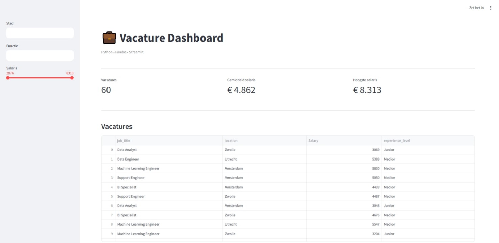
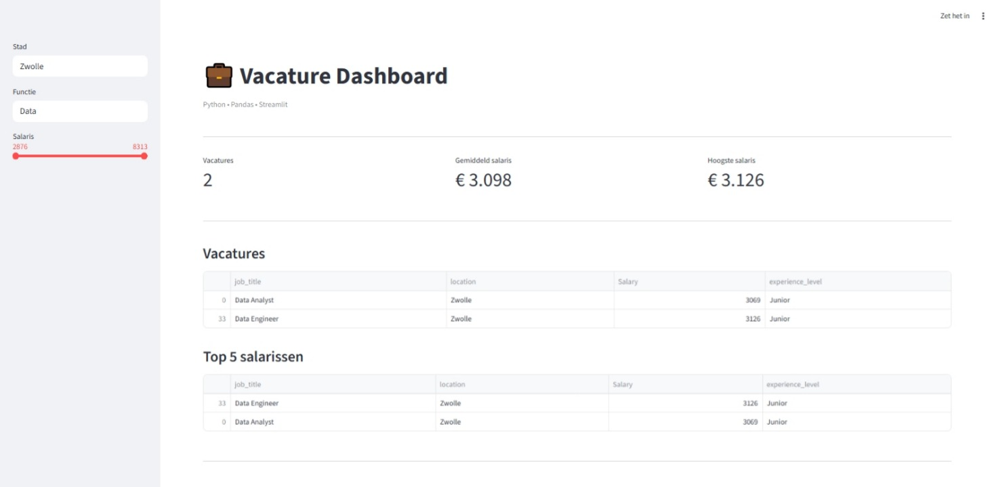
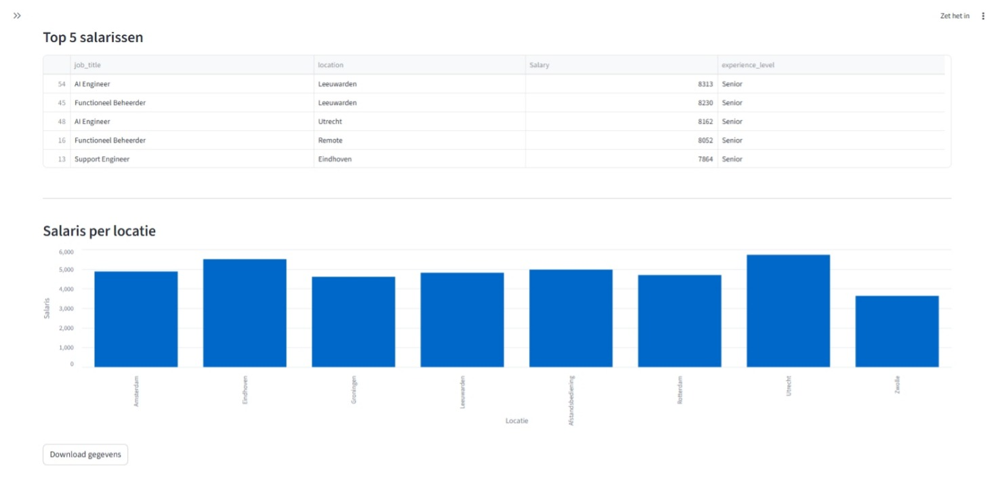

# 📊 Vacature Analyse Dashboard

Een interactief data-analyse dashboard gebouwd met Python en Streamlit waarmee vacatures inzichtelijk kunnen worden gefilterd, geanalyseerd en gevisualiseerd.

---

## 🚀 Over dit project

Dit project is ontwikkeld als portfolio-project om mijn vaardigheden in data-analyse en Python development te laten zien.

Het dashboard richt zich op het analyseren van vacaturedata en het verkrijgen van inzichten in:
- functies
- locaties
- salarissen

---

## ⚙️ Functionaliteiten

- Vacatures filteren op stad en functie
- Salarisdata analyseren
- Interactieve grafieken
- Top 5 best betaalde functies
- Zoekfunctie voor vacatures
- Overzichtelijke interface met Streamlit

---

## 🛠️ Gebouwd met

- Python
- Pandas
- Streamlit
- Altair

---

## 📸 Screenshots

### Dashboard overzicht


### Filter functionaliteit


### Salaris analyse (grafiek + top 5 functies)


---

## ▶️ Hoe start je het project?

1. Clone de repository:
```bash
git clone <jouw-repo-link>
```

2. Installeer dependencies:
```bash
pip install -r requirements.txt
```

3. Start de applicatie:
```bash
streamlit run app.py
```

---

## 🎯 Wat ik met dit project laat zien

Dit project laat zien dat ik in staat ben om:
- data te verwerken en analyseren met Pandas
- een interactieve webapp te bouwen met Streamlit
- inzichten visueel te presenteren
- gestructureerd en clean te programmeren

---

## 📌 Status

✔ Werkend prototype  
📈 Uitbreidbaar met extra filters, datasets en analyses  
